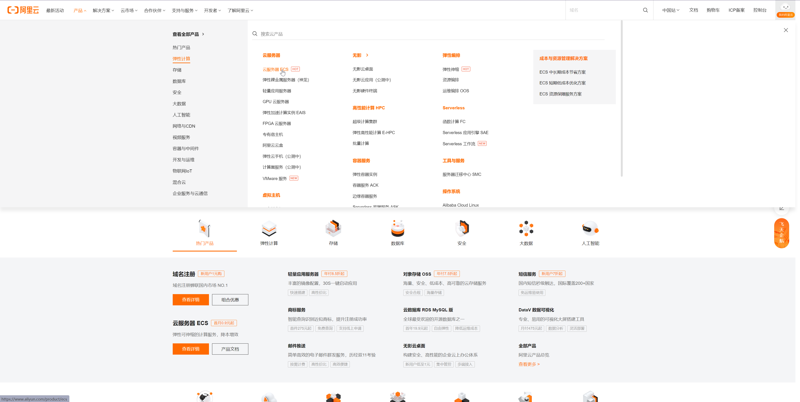
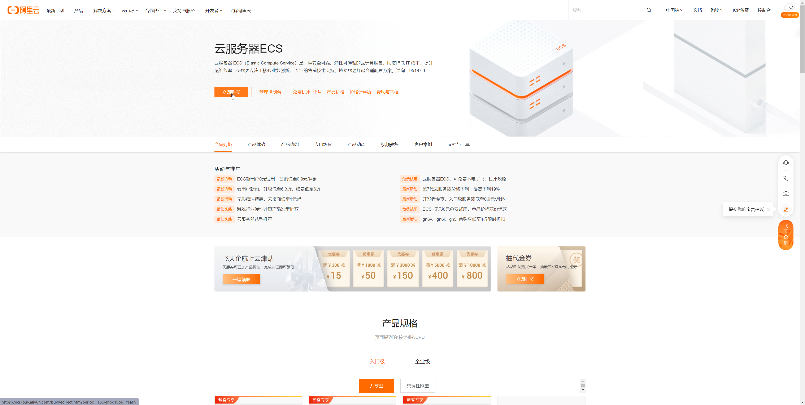
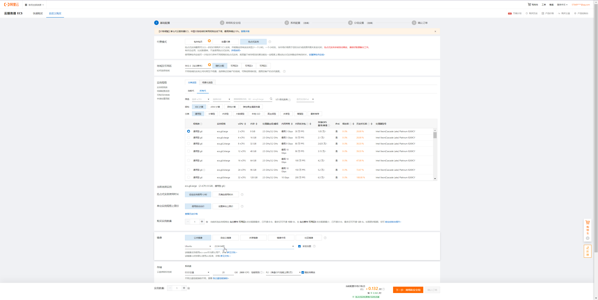
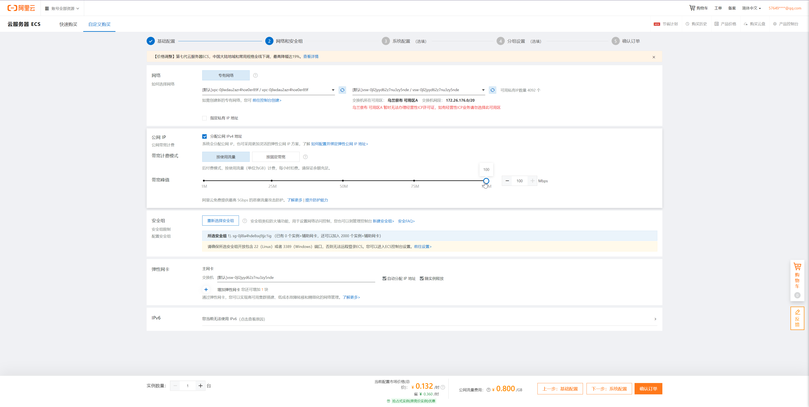
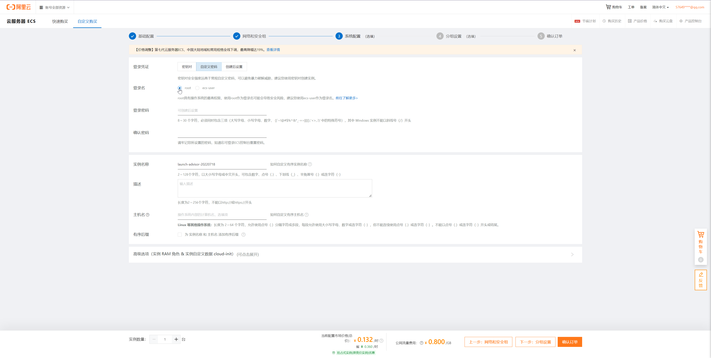
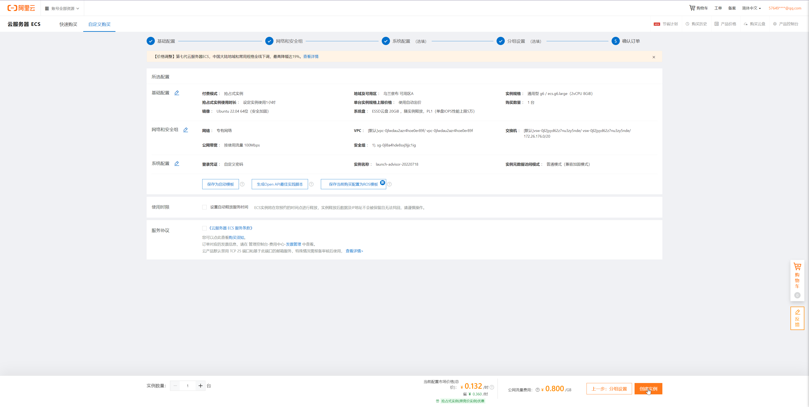

# 配置Async-rdma体验环境

## 租用云服务器

本项目基于Linux开发，若本地有Linux系统环境则无需租用云服务器。
否则建议按以下步骤租用并配置云服务器作为开发环境。
当前经过测试的发行版为Ubuntu20.04(kernel: 5.13.0)和Ubuntu22.04(kernel: 5.15.0)，较老的版本可能会有功能不全的问题。
其他发行版暂未进行测试，若有其他发行版测试成功的小伙伴欢迎到[讨论区](https://github.com/datenlord/async-rdma/discussions)反馈，遇到问题欢迎到[项目仓库](https://github.com/datenlord/async-rdma/issues)提issue或其他任何方式交流。

### 购买建议

建议使用阿里云ECS，以按需付费或抢占式实例方式租用云服务器。
若只短暂尝试可使用竞价付费方式，价格最低，可保证一小时内实例不被释放，随后释放概率0-3%。
若不希望被抢占释放可使用按需付费购买实例。若希望长期使用则选择月付或年付。

### 实例配置与购买

阿里云首页->产品->云服务器ECS->立即购买



虚拟机配置(未提到的可按默认设置或与图中保持一致)：

* 基础配置
  * 付费模式：按需付费或抢占式实例
  * 规格：x86+2vCPU+8GB内存
  * 镜像：Ubuntu 22.04
  * 存储：20GB
* 网络和安全组
  * 带宽计费模式：按使用量
  * 带宽峰值：100Mbps
* 系统配置
  * 登录凭证：自定义密码或密钥对
  * 登录名：root
* 分组设置默认即可

设置完成后确认订单，创建实例。





### 连接实例

可以通过阿里云的镜像管理网页或其他工具通过SSH连接服务器。
这里简要介绍两种连接实例并进行开发的方法。

#### 通过网页

通过阿里云提供的网页工具连接服务器，配合Vim或Nano编辑器进行开发。

阿里云首页->控制台->云服务器ECS->找到刚才建立的实例->远程连接->Workbench远程连接->立即登录

若只需要执行几条命令，例如进行环境配置，则可以：
阿里云首页->控制台->云服务器ECS->找到刚才建立的实例->远程连接->发送命令（云助手）->发送远程命令
若涉及克隆或构建操作，建议修改默认超时时间，如设置为600s。

#### 通过VSCode Remote-SSH

Rust + VSCode Remote-SSH + Rust Analyzer有更好的体验。
通过VSCode Remote-SSH连接用于开发的服务器，Rust Analyzer插件提供代码提示、跳转等功能，该网页介绍了[配置过程](https://hands-on-rust.com/2022/03/26/working-with-rust-on-a-remote-linux-server-with-rust-analyzer/)。

## 实验环境配置脚本

在服务器中执行以下脚本则可以建立Async-rdma开发环境并进行构建和测试。也可以手动输入执行。

``` shell
#!/bin/bash

# It is recommended to use root for trial

# install dependences
sudo apt update

sudo apt install -y libibverbs1 ibverbs-utils librdmacm1 libibumad3 ibverbs-providers rdma-core libibverbs-dev iproute2 perftest build-essential net-tools git librdmacm-dev rdmacm-utils cmake libprotobuf-dev protobuf-compiler clang curl pkg-config

# install rust
curl --proto '=https' --tlsv1.2 -sSf https://sh.rustup.rs | sh -s -- --default-toolchain 1.61.0 -y &&
source "$HOME/.cargo/env"

# link rdma netdev
if [ `ifconfig -s | grep -c '^e'` -eq 0 ]; then
    echo "no eth device"
    exit 1
elif [ `ifconfig -s | grep -c '^e'` -gt 1 ]; then
    echo "multiple eth devices, select the first one"
    ifconfig -s | grep '^e'
fi

ETH_DEV=`ifconfig -s | grep '^e' | cut -d ' ' -f 1 | head -n 1`
RXE_DEV=rxe_eth0

sudo rdma link delete $RXE_DEV
sudo rdma link add $RXE_DEV type rxe netdev $ETH_DEV
rdma link | grep $RXE_DEV

# clone && build && test async-rdma
# use domestic mirror here
# replace "kgithub" with "github" if you can access it
# git clone https://github.com/datenlord/async-rdma.git &&
git config --global http.sslVerify false
git clone https://kgithub.com/datenlord/async-rdma.git &&
cd async-rdma &&
cargo b &&
cargo t
```
